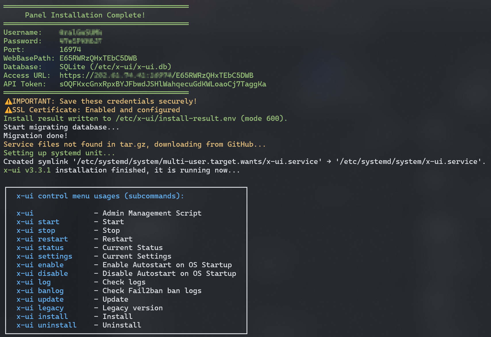
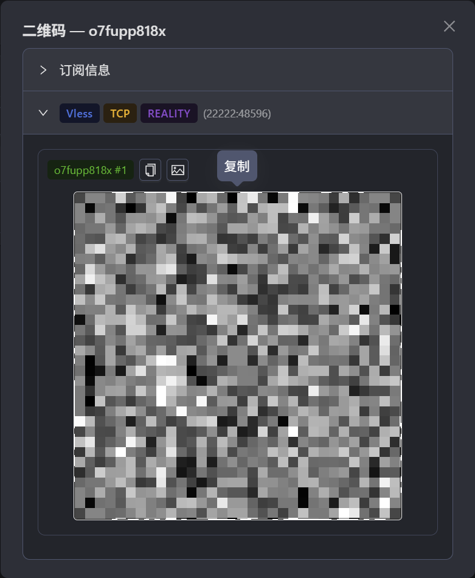
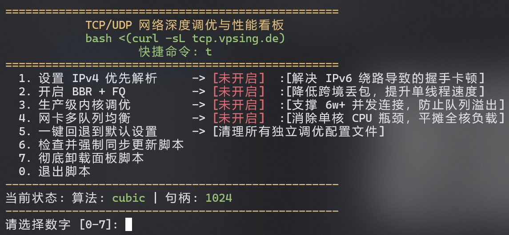
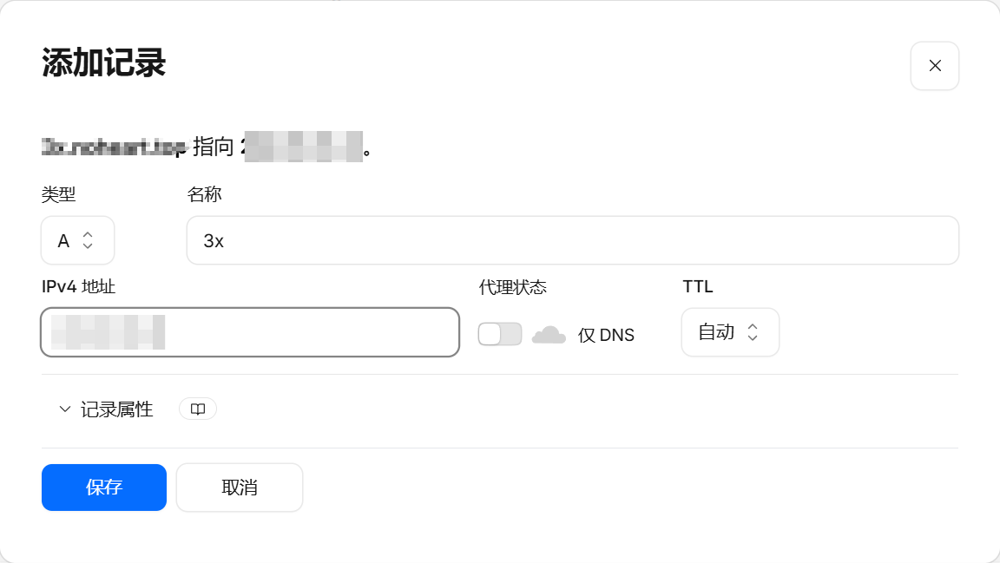
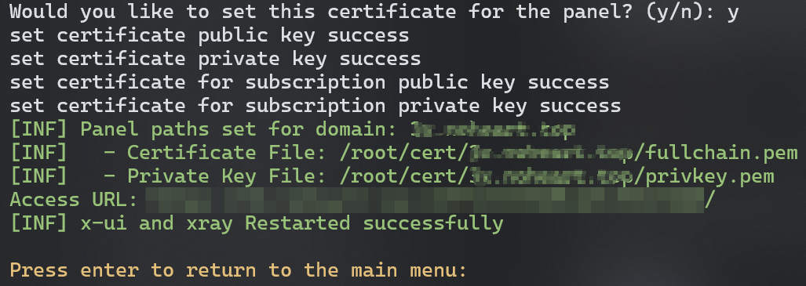

---
{
  title: 3x-ui面板搭建VPS,
  date: 2026-06-18,
  tags: [ Proxy, VPS ],
  draft: false,
  archive: true,
  slug: essay-260618-20by
}
---

## SSH
通过ssh命令连接你的VPS，以root身份登录：
```bash
ssh root@IPv4地址 -p 22
```

重新安装VPS系统会导致主机密钥变更，连接会被拦截，需要重新生成密钥：
```bash
ssh-keygen -R IPv4地址
```

更新系统与软件包，并安装sudo和curl：
```bash
apt update && apt full-upgrade -y && apt install -y sudo curl
```

安装3x-ui面板：
```bash
bash <(curl -Ls https://raw.githubusercontent.com/mhsanaei/3x-ui/master/install.sh)
```

所有操作回车均为选择默认值：
- Database Selection：回车
- Panel Port：回车
- SSL Certificate：回车
- IPv6：回车
- ACME HTTP-01 listener：回车

等待安装完毕后，Access URL与账号密码会显示在终端上，`/etc/x-ui/install-result.env`永久存储登录信息，打开浏览器访问终端显示的 Access URL，使用生成的用户名和密码登录 3x-ui 面板，然后点击左侧『入站』→ 添加入站：



## 添加节点

### 入站
只需要配置三项，其他的面板会自动配置：
- 备注：随便填
- 协议：vless
- 安全：Reality
### 客户端
关联入站选择刚才添加的入站，凭据——FLow选择`xtls-rprx-vision`

## 使用节点
点击创建好的客户端左侧二维码，展开订阅信息下方的节点，点击复制，此时为`vless://`开头的节点，clash系列需进行订阅转换才能导入使用，小火箭或者v2rayN直接扫描二维码即可。



## TCP调优
使用6神的TCP优化工具进行深度调优，设置1-4即可：
```bash
bash <(curl -sL http://tcp.vpsing.de)
```



## 进阶设置
按照以上方法配置好后应该可以正常使用，但细心的话会发现日志里面出现警告：
```bash
2026/06/22 08:34:10 WARNING - XRAY: core: Xray 26.6.1 started

2026/06/22 08:34:10 WARNING - XRAY: infra/conf: REALITY: Listening on non-443 ports may get your IP blocked by the GFW
```

两种办法解决，一个是直接修改入站端口为443，因为443端口是HTTPS流量标准端口，如果是随机生成的非常用端口，会更容易被GFW检测出来。另一个方法是通过添加域名解析：

首先将已经托管到cloudflare的域名添加DNS记录，类型为A，名称随意，IPv4地址填写VPS地址，代理状态关闭，设置后点击保存。



ssh重新连接到VPS，输入`x-ui`命令进入3x-ui面板设置界面，输入19，访问`19. SSL Certificate Management`选项。

此时弹出七个选项，输入1，`1. Get SSL (Domain)`，然后提示输入域名，这里输入前面配置好的子域名，也就是`3x.你的域名`这一串，然后下一步选择端口，回车默认80就行，提示ACME，回车默认，最后关键的一步`Would you like to set this certificate for the panel? (y/n)`，输入y把证书安装到面板上，安装完成后提示回车返回到主菜单。

> 注意⚠️: 此时Access URL不再是之前的`https://IPv4地址/WebBasePath`，而是指向子域名，用户名和密码没变。



把之前的入站和客户端删除，新建的入站将端口设置为443，其他和之前一样，客户端同理。

## 相关链接
- [海豚测速](https://www.haitunt.org)
- [海豚测速订阅转换](https://sub.haitunt.org)
- [VPS实时监控](https://vpsing.de)
- [EVOXT](https://evoxt.com)
