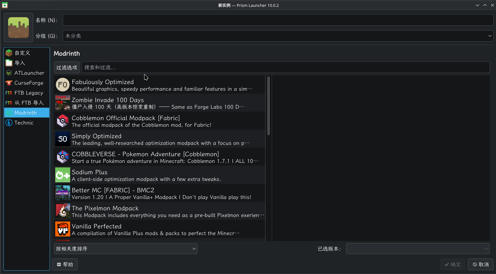
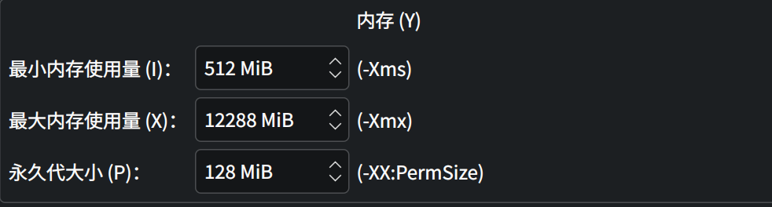

---
{
  title: CachyOS,
  description: CachyOS性能向Arch Linux发行版的使用配置，含游戏、代理、媒体,
  date: 2026-01-23,
  updatedAt: 2026-03-02,
  tags: [ Linux, CachyOS ],
  draft: false,
  archive: true
}
---
# About

CachyOS是基于Arch Linux并以卓越性能著称的Linux发行版系统，拥有和EndeavourOS相似的图形化安装程序。

# Partition

目前2+148的分区组合用着很不舒服，基本上update一两次就会报空间不足了，AI推荐8-12G，我直接一步到位了，分20G，也就是20+180。目前来看我的系统除去游戏以及各种缓存，实际占用只有20-30G左右，180G如果不存什么大型文件，其实日用+开发也很难用完。

# Gaming

## PrismLauncher

使用paru安装prismlauncher：

```bash
# 如果报错请先更新
paru -S prismlauncher
```

~~目前从CurseForge下载整合包会出现hash校验出错，建议使用Modrinth：~~



prism默认最大只分配4G给Java用，需要从设置里修改：



如果出现启动实例Hash校验报错，直接添加全局Java参数：

```bash
-Dforgewrapper.skipHashCheck=true
```

# Proxy

目前测试的代理软件，只有v2raya和clash verge rev能正常使用，后者配置十分简单，开箱即用，前者参考Arch Linux代理部分：

```bash
paru -S clash-verge-rev-bin
```

# Media

## mpv+uosc

个人觉得KDE自带的Haruna不是特别好用，原生mpv又太简陋了，推荐使用uosc脚本：

```bash
paru -S mpv-uosc-git
# 安装缩略图预览
paru -S mpv-thumbfast-git
```

编辑**~/.config/mpv/mpv.conf**：

```bash
hwdec=auto-safe      
vo=gpu-next          
video-sync=display-resample
script-opts-append=uosc:timeline_persistency=always
```

# Sound

扬声器在Linux下非常难听，需要安装asusctl并重启电脑即可解决：

```bash
sudo pacman -S asusctl
```

还可以安装rog控制中心，用于管理硬件设备，类似奥创但要轻便的多：

```bash
paru -S rog-control-center
```

# Font

CachyOS的KDE显示中文字体会出现渲染问题，将Fonts-General设置为Noto Sans CJK SC来避免，但是浏览器以及终端需要再单独设置，终端可参考Ghostty页面。

```bash
sudo pacman -S noto-fonts noto-fonts-cjk noto-fonts-emoji
```

# Reference

[CachyOS — Blazingly Fast OS based on Arch Linux](https://cachyos.org/)
