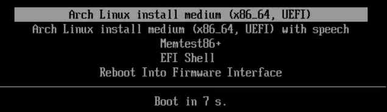

---
{
  title: Arch Linux,
  description: Arch Linux最小化系统完整安装流程，从分区到GRUB引导,
  date: 2025-11-12,
  updatedAt: 2026-01-27,
  tags: [ Linux, Arch Linux ],
  draft: false,
  archive: true
}
---
# 1 准备工作

## 1.1 下载ISO镜像

从任意国内镜像网站下载，这里用清华大学镜像站举例。进入后，下载以x86_64.iso结尾最新日期的ISO文件，并将其存入USB设备，通过Ventoy进行引导安装。

## 1.2 进入Live安装环境

通过Ventoy进入安装环境，选择最上方的`Arch Linux install medium (x86_64, UEFI)`，按下Enter进入。等待一会儿，直到出现Welcome to Arch Linux。



## 1.3 设置控制台字体大小

初始默认字体比较小，这里我们用**setfont**命令临时调整字体：

```bash
setfont ter-132b
```

## 1.4 检查网络连接

若连接Wi-Fi，使用**iwctl**认证无线网络：

```bash
iwctl
```

进入**iwctl**后，依次输入：

```bash
device list                                
station yourcard scan                      
station yourcard get-networks              
station yourcard connect "your WIFI"       
exit                                       
```

使用**ping**命令检查是否能连接上Arch官网：

```bash
ping archlinux.org
```

**注意：**老机器可能无法正常连接Wi-Fi，建议直接使用网线连接。

## 1.5 更新系统时间

使用**timedatectl**命令同步系统时间：

```bash
timedatectl set-ntp true
```

## 1.6 操作硬盘分区

通过`fdisk -l`命令，查看目前硬盘状态，我们可以使用`cfdisk`命令来进行GPT分区操作，具体分区如下表：

| 挂载点 | 分区 | 分区类型 | 建议大小 |
| --- | --- | --- | --- |
| /boot或/efi | /dev/efi_system_partition | EFI System | 1 GiB |
| [SWAP] | /dev/swap_partition | Linux swap | 至少4 GiB |
| / | /dev/root_partition | Linux root (x86-64) | 设备剩余空间，至少23-32 GiB |

注意：如果电脑上已有EFI分区，则无须创建直接挂载即可；SWAP分区选择创建，非强制性，后续还可以用swapfile。

## 1.7 格式化分区

注意⚠️：如果电脑上已有EFI系统分区，不要对其格式化，跳过执行后续步骤。

在根分区上创建Ext4文件系统：

```bash
mkfs.ext4 /dev/root_partition
```

创建EFI系统分区，将其格式化为Fat32：

```bash
mkfs.fat -F 32 /dev/efi_system_partition
```

初始化交换分区：

```bash
mkswap /dev/swap_partition
```

## 1.8 挂载分区

先将**根分区**挂载到**/mnt：**

```bash
mount /dev/root_partition /mnt
```

再把**EFI系统分区**挂载到**/mnt/efi：**

```bash
mkdir -p /mnt/efi
mount /dev/efi_system_partition /mnt/efi
```

最后启用**Swap**分区：

```bash
swapon /dev/swap_partition
```

提示：EFI系统分区挂载到**/mnt/efi**，系统内显示为**/efi**。

## 1.9 Swapfile

相比**SWAP**分区，**swapfile**修改更加灵活：

```bash
fallocate -l 4G /swapfile
chmod 600 /swapfile
mkswap /swapfile
swapon /swapfile
```

写入/etc/fstab中，使其永久生效：

```bash
echo '/swapfile none swap sw 0 0' >> /etc/fstab
```

**注意：**这一步要在**chroot**后执行，不然只是在**Live**环境中启用。

# 2 开始安装

## 2.1 选择镜像站

在/etc/pacman.d/mirrorlist中选几个国内镜像站激活(取消注释)，如果没有，可以从[https://archlinux.org/mirrorlist/](https://archlinux.org/mirrorlist/)查询国内镜像地址并手动输入URL，或者使用curl来下载：

```bash
curl -L 'https://archlinux.org/mirrorlist/?country=CN&protocol=https' -o /etc/pacman.d/mirrorlist
```

将所有镜像站注释，手动添加：

```bash
## China
Server = https://mirrors.tuna.tsinghua.edu.cn/archlinux/$repo/os/$arch
```

使用reflector生成高速镜像列表：

```bash
reflector --country China --protocol https --latest 5 --sort rate --save /etc/pacman.d/mirrorlist
```

## 2.2 安装必备软件包

为避免出现签名错误，在安装之前先更新密钥：

```jsx
pacman -Sy archlinux-keyring
```

使用**pacstrap**来安装base软件包和Linux内核以及常规硬件的固件：

```bash
pacstrap -K /mnt base linux linux-firmware intel-ucode amd-ucode
```

除此之外，还需安装文本编辑器和网络管理器：

```bash
pacstrap -K /mnt vim networkmanager
```

> 下面这步不确定还需不需要再执行，后续测试后再修改。
> 

同时建议安装GPG Key，避免出现签名问题：

```bash
pacstrap -K /mnt archlinux-keyring
```

**提示：**如果一直出现签名或者GPG问题，尝试多安装几次GPG Key。

# 3 系统配置

## 3.1 Fstab

生成**fstab**文件，将需要的文件系统在启动时被自动挂载：

```bash
genfstab -U /mnt > /mnt/etc/fstab
```

## 3.2 Chroot

此时我们所处Live安装环境中，需要使用**arch-chroot**命令切换到新安装的系统来进行后续操作：

```bash
arch-chroot /mnt
```

## 3.3 设置时间和时区

使用**ln**命令来设置时区：

```bash
ln -sf /usr/share/zoneinfo/Asia/Shanghai /etc/localtime
```

将系统时间写入硬件时钟：

```bash
hwclock --systohc
```

## 3.4 Mkinitcpio

~~为了防止系统无法正常启动，使用**mkinitcpio**命令生成**initramfs**，其中initramfs能确保系统顺利从内核启动过渡至根文件系统：~~

```bash
~~mkinitcpio -P~~
```

## 3.5 本地化设置

要设置本地化为英语，我们进入/etc/locale.gen，将`en_US.UTF-8 UTF-8`取消注释，然后生成locale信息：

```bash
locale-gen
```

编辑设定**LANG**变量：

```bash
echo "LANG=en_US.UTF-8" > /etc/locale.conf
```

## 3.6 网络配置

设置主机名：

```bash
echo myarch > /etc/hostname
```

开启网络服务：

```bash
systemctl enable NetworkManager
```

编辑/etc/hosts文件：

```bash
127.0.0.1 localhost
::1       localhost
127.0.1.1 myarch.localdomain myarch
```

## 3.7 设置root密码

使用**passwd**设置密码：

```bash
passwd
```

## 3.8 安装引导程序

首先安装grub、efibootmgr和os-prober软件包：

```bash
pacman -S grub efibootmgr os-prober
```

将GRUB引导器安装到EFI系统分区：

```bash
# 如果是Mac必须加--removable选项
grub-install --target=x86_64-efi --efi-directory=/efi --bootloader-id=Arch
```

编辑**/etc/default/grub**，取消下面这行的注释：

```jsx
#GRUB_DISABLE_OS_PROBER=false
```

然后生成主配置文件：

```bash
grub-mkconfig -o /boot/grub/grub.cfg
```

最后检查BIOS/UEFI兼容性：

```bash
grub-install --recheck
```

# 4 重启计算机

使用**exit**命令或者按`Ctrl+d`退出chroot环境：

```bash
exit
```

如果启用交换分区，使用**swapoff**关闭：

```bash
swapoff -a
```

通过**umount**命令，手动卸载被挂载的分区：

```bash
sync
umount -R /mnt
```

最后重启电脑，并移除安装介质：

```bash
reboot
```

若无法正常进入系统，可通过Live环境重新进入chroot来进行修复：

```bash
mount /dev/root_partition /mnt
mount /dev/efi_system_partition /mnt/efi
arch-chroot /mnt
```

# 5 后续建议

## 5.1 创建用户

添加新用户**kk**：

```bash
useradd -m -G wheel,audio,video,storage kk
passwd kk
```

允许wheel组的用户使用sudo，并设置免密：

```bash
pacman -S sudo
echo '%wheel ALL=(ALL:ALL) NOPASSWD: ALL' > /etc/sudoers.d/wheel_nopasswd
```

如果不想设置免密：

```bash
echo '%wheel ALL=(ALL:ALL) ALL' > /etc/sudoers.d/wheel
```

## 5.2 Archlinuxcn

在 /etc/pacman.conf 末尾添加：

```bash
[archlinuxcn]
SigLevel = Never
Server = https://mirrors.tuna.tsinghua.edu.cn/archlinuxcn/$arch
```

安装密钥环和自动镜像列：

```bash
pacman -Sy archlinuxcn-keyring
pacman -S archlinuxcn-mirrorlist-git
```

把固定 Server 改成动态 Include ，并删除 SigLevel，再进 mirrorlist 挑几个镜像站取消注释：

```bash
[archlinuxcn]
#Server = https://mirrors.tuna.tsinghua.edu.cn/archlinuxcn/$arch   
Include = /etc/pacman.d/archlinuxcn-mirrorlist
```

完整升级系统：

```bash
pacman -Syyu
```

## 5.3 AUR

使用yay安装与管理AUR中的包：

```bash
pacman -S git base-devel yay
```

也可以从git拉取进行编译构建：

```bash
git clone https://aur.archlinux.org/yay.git
cd yay
makepkg -si
```

更推荐使用paru来替代yay：

```jsx
pacman -S paru
```

> 注意：使用pacman安装yay与paru时，需提前配置好archlinuxcn仓库，否则安装时会提示不存在。
> 

## 5.4 软件列表

- Ghostty+ fish + starship + btop + fastfetch + eza + bat + fzf + ripgrep + zoxide + tldr + wget + curl + yazi + ncdu + fd + zellij + rsync + dust + duf
- yay + paru + topgrade
- yt-dlp
- Neovim + LazyVim
- VSCode
- ZenBrowser + Chromium
- SPlayer
- LibreOffice
- mpv
- OBS
- Obsidian
- Pinta
- LocalSend
- Signal
- Kdenlive
- Mise
- Docker
- Notion
- QtScrcpy / Scrcpy

> 以上大部分包均可通过**TuxMate**网站快速生成安装命令。
> 

## 5.5 配置代理

使用yay安装v2raya并设置开机自启：

```bash
yay -S v2raya
sudo systemctl enable --now v2raya.service
```

浏览器打开 **http://127.0.0.1:2017** 导入订阅后，全局设置逐项按下表配置：

| 设置项 | 推荐值 | 简要说明 | 详细解释 |
| --- | --- | --- | --- |
| Transparent Proxy / System Proxy | On: Traffic Splitting Mode is the Same as the Rule Port | 全局透明代理 | 开启后所有程序自动走规则，无需手动设置。勾选“与 Rule Port 模式一致”可避免浏览器再次弹出代理设置对话框，体验最丝滑。不开的话只有手动设了代理的程序才能科学上网。 |
| Transparent Proxy / System Proxy Implementation | redirect | 兼容性最好 | redirect 用 iptables 重定向流量，几乎兼容所有 Linux 发行版和网络环境。tproxy 在某些 Wi-Fi 驱动、虚拟机、特定内核版本会直接掉线或无网络，普通用户一律选 redirect 永远不出问题。 |
| Traffic Splitting Mode of Rule Port | RoutingA | 必须选 RoutingA | 本节提供的全部规则都是用 RoutingA 语法写的，只有选它规则才会生效。选错成 Routing 或 Fake-IP 会导致所有网站都直连或全走代理，彻底失效。 |
| Prevent DNS Spoofling | DoH (dns-over-https) | 防 DNS 污染 | 开启后所有 DNS 查询强制走加密通道（默认用 Cloudflare 1.1.1.1），彻底杜绝运营商/墙返回假 IP。关闭的话国内很多被污染的域名（Google、Twitter 等）会直接解析到错误 IP，导致打不开。 |
| Special Mode | Off | 避免内网也被代理 | 打开后局域网（192.168.x.x）、NAS、路由器后台、打印机全部走代理，导致内网彻底失联。99.99% 用户必须关闭。 |
| TCP Fast Open | Off | 多数节点不支持 | 大部分机场节点没开 TFO 支持，强行打开会导致首次连接超时、反复重试、卡在 Handshake，表现为网页转圈很久才出。关掉最稳。 |
| Sniffing | Http + TLS + QUIC | 精准识别域名 | 开启嗅探后 v2rayA 能从加密流量里提取真实域名（SNI），避免把 openai.com 误判成 Cloudflare IP 直连。关掉的话 ChatGPT、GitHub Raw 等高频网站会经常打不开。 |
| Multiplex | Off | 普通用户无需 | 多路复用在高延迟或不稳定节点反而更卡、掉线更频繁。机场订阅基本都是单连接最稳，打开只增加故障率。 |
| Automatically Update Subscriptions | Off | 手动更新更安全 | 关闭自动更新可防止半夜节点突然全部失效，或者更新瞬间触发机场风控封号。建议每天自己点一次“更新订阅”最可控。 |
| Mode when Update Subscriptions and GFWList | Follows Transparent Proxy/System Proxy | 更新时不暴露 IP | 更新订阅/规则时保持当前代理状态，避免那几秒钟所有流量直连导致真实 IP 暴露给机场或被墙记录。 |

**RoutingA规则：**

```bash
default: proxy

domain(domain:163.com, domain:qq.com, domain:wechat.com)->direct
domain(domain:jd.com, domain:taobao.com)->direct
domain(domain:heiyu.space, domain:lazycat.cloud)->direct

domain(domain:unsplash.com)->proxy

domain(geosite:google-scholar)->proxy
domain(geosite:category-scholar-!cn, geosite:category-scholar-cn)->direct
domain(geosite:geolocation-!cn, geosite:google)->proxy
domain(geosite:cn)->direct
ip(geoip:hk,geoip:mo)->proxy
ip(geoip:private, geoip:cn)->direct
```

**提示：**RoutingA 语法对换行非常感，输入的时候尽量避免换行。

## ~~5.6 中文输入法~~

~~安装Fcitx5框架：~~

```bash
sudo pacman -S fcitx5-im fcitx5-rime fcitx5-chinese-addons
```

~~配置Hyprland，编辑~/.config/hypr/hyprland.conf，加入以下内容：~~

```bash
exec-once = fcitx5 -d                                   
env = GTK_IM_MODULE,fcitx
env = QT_IM_MODULE,fcitx
env = XMODIFIERS,@im=fcitx
env = SDL_IM_MODULE,fcitx
env = GLFW_IM_MODULE,ibus
```

## 5.7 Desktop

## 5.8 Archinstall

如果已经熟练掌握Arch Linux的基本安装方法，则可以使用archinstall脚本快速安装Arch，进入Live环境后直接执行即可：

```bash
archinstall
```
## 5.9 安装心得


1. pacstrap那一步，不止要装base、linux、linux-firmware，还有vim和networkmanager，不然后面没网没编辑器，并且重启前要打开网络服务`systemctl enable NetworkManager`。
2. 重启之前一定要确保所有步骤全部做完，包括root密码和GRUB引导设置，否则会启动不了系统。
3. 安装字体`pacman -S terminus-font`，然后临时设置setfont ter-132b，永久设置进入/etc/vconsole.conf，添加FONT=ter-132b即可。
4. 如果真有什么问题，将ISO插入机器，从UEFI进入Live环境，先将三个分区全部挂载，然后`arch-chroot /mnt`进入即可进行联网操作。
5. Linux代理和Windows差别比较大，Windows一般来说基本不用自己进行代理设置，代理软件会默认设置好，开箱即用，而LInux则需要针对桌面环境，浏览器，环境变量几个地方单独设置。

目前Arch LInux中我找到的正确做法是：

- KDE桌面代理设置为无
- 注释/etc/enviroment代理相关环境变量
- Firefox设置手动代理，使用SOCKS v5地址127.0.0.1端口10808，并勾选下方通过SOCKS v5代理DNS

太难绷了，刚折腾完，结果才发现王总的v2raya才是最方便且最好用的，当然不是我不用，主要是yay安装v2raya今天也出问题了。按照教程来就行，系统以及浏览器的代理都选无，我都试过一遍没问题。

# 6 参考资料

[安装指南 -  Arch Linux 中文维基](https://wiki.archlinuxcn.org/wiki/%E5%AE%89%E8%A3%85%E6%8C%87%E5%8D%97)

[最佳代理实践 (2025-8-31)](https://manateelazycat.github.io/2025/08/31/best-proxy)

[Index of /archlinux/iso/ | 清华大学开源软件镜像站 | Tsinghua Open Source Mirror](https://mirrors.tuna.tsinghua.edu.cn/archlinux/iso)

[Hyprland: Dynamic tiling window compositor with the looks](https://hypr.land/)

