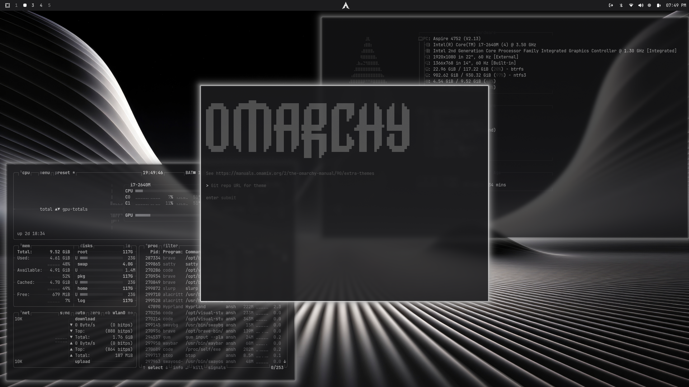
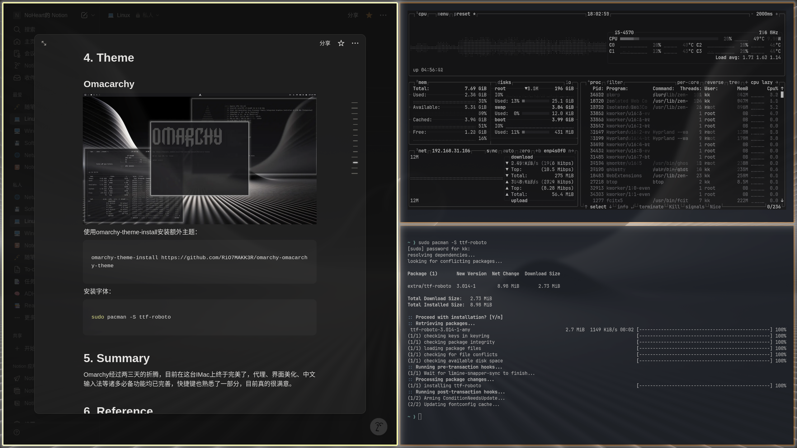

---
{
  title: Omarchy,
  description: Arch Linux + Hyprland定制系统Omarchy的双系统安装与主题配置,
  date: 2025-11-22,
  updatedAt: 2026-01-16,
  tags: [ Linux, Omarchy ],
  draft: false,
  archive: true
}
---
# 1. About

由DHH开发的Arch Linux + Hyprland的集成定制Linux系统，预装了大量日常以及开发所需用到的软件，兼顾美观与高效。

# 2. Normal Install

使用Omarchy的ISO文件，根据提示安装即可。注意常规安装需要单独准备一块磁盘，如果需要双系统请参考其他方法。

# 3. Dual Boot Omarchy & Windows

## Getting Started

- 使用diskmgmt压缩出200G空闲分区
- U盘上刻录好Omarchy-3.2.0.ISO
- 电脑预装Windows10/11
- 关闭SecureBoot和Bit-Locker Encryption

## Load Omarchy Install Media

从BIOS进入U盘Ventoy，选择Omarchy，以normal模式进入，等待片刻进入Omarchy安装界面，按下三次ESC退出后进入到Arch Linux的Live界面，执行setfont命令来增加字体大小：

```bash
setfont ter-132n
```

使用iwctl连接WI-FI，连接网线则跳过此步：

```bash
iwctl
device list

# 一般网卡默认叫wlan0
station wlan0 get-networks
station wlan0 connect Wifi_name

exit
```

如果网卡没有开启，执行以下命令：

```bash
device wlan0 set-property Powered on
```

连接后使用ping测试是否正常上网：

```bash
ping -c 5 bing.com
```

## Disk Partitions

使用**cfdisk**命令来进行分区操作：

| 分区 | 分区类型 | 大小 |
| --- | --- | --- |
| /dev/efi_system_partition | EFI System | 4G |
| /dev/root_partition | Linux filesystem | 剩余空间 |

分区完成后使用lsblk查看对应分区信息：

```bash
lsblk
```

将EFI系统分区格式化：

```bash
mkfs.fat -F32 /dev/efi_system_partition
```

将根分区格式化为btrfs类型：

```bash
mkfs.btrfs -f /dev/root_partition
```

将根分区挂载到/mnt上：

```bash
mount /dev/root_partition /mnt
```

创建挂载点/mnt/boot，将EFI分区挂载：

```bash
mkdir /mnt/boot
mount /dev/efi_system_partition /mnt/boot
```

## Archinstall

使用archinstall脚本来完成后续安装：

| 选项 | 操作 |
| --- | --- |
| Mirrors and repositories | Select regions > China |
| Disk configuration | Partitioning > Pre-mounted configuration；Root mount directory：/mnt  |
| Swap | Yes |
| Bootloader | Limine |
| Hostname | archlinux |
| Authentication | Root password > root；User account > Add a user > kk sudo yes > Confirm and exit |
| Applications | Audio > pipeware |
| Nerwork configuration | Copy ISO network configuration to installation |
| Timezone | Asia：Shanghai |

安装完成后，选择chroot选项进入：

```bash
chroot into installation for post-installation configurations
```

## Update PacMan Database

更新pacman数据库：

```bash
pacman -Sy
```

进行完整系统升级：

```bash
pacman -Syyu
```

安装Omarchy依赖：

```bash
pacman -S vim nano fastfetch htop gcc make cmake git curl perl wget terminus-font
```

添加 ArchLinuxCN 仓库，在 `/etc/pacman.conf` 文件末尾添加以下两行：

```jsx
[archlinuxcn]
Server = https://repo.archlinuxcn.org/$arch
```

更新数据库并安装 archlinuxcn-keyring：

```jsx
pacman -Sy archlinuxcn-keyring
```

更新系统并安装镜像仓库列表：

```jsx
pacman -Su archlinuxcn-mirrorlist-git
```

安装完成后退出chroot：

```bash
exit
```

卸载所有挂载点，重启并移除安装介质：

```bash
umount -lR /mnt
reboot now
```

## Install Omarchy

重启进入Arch Linux后，使用curl安装Omarchy，安装完成后重启电脑：

```bash
curl -fsSL https://omarchy.org/install | bash
```

**注意：**这里很大概率下载失败，透明代理只能代理前面的Clone操作，从Omarchy仓库下载时不会走代理，需要至少网关共享级别的代理支持。

## Configure Limine Boot Manager

按下super+enter打开终端，输入sudo -i暂时成为root用户：

```bash
sudo -i
```

输入limine-scan，扫描所有的启动项，找到Windows所处位置，输入编号后回车确认：

```bash
limine-scan
```

切换目录到/boot/EFI/Linux，找到omarchy_linux.efi：

```bash
cd /boot/EFI/Linux
```

复制omarchy_linux.efi文件到/boot/EFI/limine/目录下：

```bash
cp omarchy_linux.efi ../limine/
```

将源文件重命名，避免命名冲突：

```bash
mv omarchy_linux.efi omarchy_linux.efi.bak
```

~~切换到/boot/EFI/limine目录下：~~

```bash
~~cd /boot/EFI/limine~~
```

~~将limine.conf重命名：~~

```bash
~~mv limine.conf limine.conf.bak~~
```

> 上面这两句不确定是否需要删除，因为我自己测试的时候/boot/EFI/limine目录下没有limine.conf文件，故跳过执行。
> 

切换到/boot目录下：

```bash
cd /boot
```

备份limine.conf文件：

```bash
cp limine.conf limine.conf.bak
```

编辑/boot/limine.conf文件：

```bash
vim limine.conf
```

取消#timeout: 3注释，并将其改为30：

```bash
timeout: 30
```

接着往下找到Omarchy的image_path，将/EFI/Linux/omarchy_linux.efi#改为/EFI/limine/omarchy_linux.efi#，然后保存退出：

```bash
image_path: boot():/EFI/Linux/omarchy_linux.efi#………………
image_path: boot():/EFI/limine/omarchy_linux.efi#………………
```

# 4. Theme

## Omacarchy



使用omarchy-theme-install安装额外主题：

```bash
omarchy-theme-install https://github.com/RiO7MAKK3R/omarchy-omacarchy-theme
```

安装字体：

```bash
sudo pacman -S ttf-roboto
```

**警告⚠️：**

目前由于Omarchy3.3系统引入了动态border coloring，导致部分窗口边框颜色不随主题而变化，需要修改~/.config/hypr/looknfeel.conf文件才行。而且修改还不能加很多东西，目前只能加general里面的一些属性，比如active_border和inactive_border，多加少加都会变回橙色。目前主题文件路径为~/.config/omarchy/themes/omacarchy/hyprland.conf，粗略统计好像只有平铺窗口的边框没有正常生效，其他地方均为当前设置主题的效果。

这个looknfeel.conf文件可以直接从style—hyprland进入修改，根据DHH演示的视频来看，这个文件主要是用于额外调整一些外观设置，边框颜色问题估计是安装的时候出BUG了，目前无解。

太2b了，要是之前看完了DHH的演示视频，根本不会有这么多问题，很多东西都有解决办法😢。

# 5. Summary

Omarchy经过两三天的折腾，目前在这台IMac上终于完美了，代理、界面美化、中文输入法等诸多必备功能均已完善，快捷键也熟悉了一部分，目前真的很满意。



# 6. Reference

[Omarchy](https://omarchy.org/)

[Omarchy 3](https://youtu.be/L3EafsSCv80)
