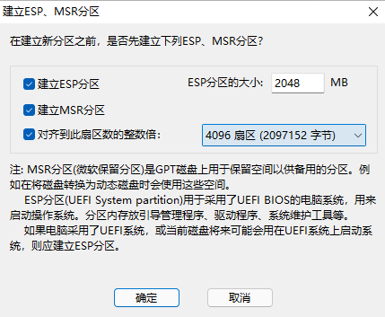

---
{
  title: ROG魔霸6Plus,
  description: 魔霸6Plus CPU蓝屏故障记录、维修历程与系统恢复方法,
  date: 2025-09-20,
  tags: [ ROG ],
  draft: false,
  archive: true,
  slug: essay-250920-vnvn
}
---
## 1. 基本参数

- **处理器（CPU）**：AMD Ryzen 9 6900HX，8 核 16 线程，基础频率 3.3GHz，最高加速频率 4.9GHz，基于 Zen 3+ 架构，6nm 工艺。
- **显卡（GPU）**：NVIDIA GeForce RTX 3070 Ti 笔记本电脑 GPU，满功率 150W，8GB GDDR6 显存，256bit 位宽，支持独显直连。
- **内存**：16GB DDR5 4800MHz（可扩展至 64GB），双通道设计，内存带宽更高。
- **存储**：1TB PCIe 4.0 SSD，支持快速数据传输与加载。
- **屏幕**：17.3 英寸，分辨率 2.5K（2560×1440），240Hz 高刷新率，3ms 响应时间，300nits 亮度，100% DCI-P3 色域，支持 Dolby Vision、DC 调光和防撕裂技术。
- **散热系统**：ROG 冰川散热架构 2.0，液态金属导热，双风扇，六热管，四个出风口，提升散热效率并降低噪音。
- **音频**：杜比全景声（Dolby Atmos），Smart AMP 双扬声器，AI 降噪麦克风。
- **电池**：90Wh 大容量锂电池，支持 100W PD 快充。
- **网络**：Wi-Fi 6E 无线网卡，2.5G 有线网卡，蓝牙 5.2。
- **接口**：2× USB 3.1 Type-A、2× USB 3.2 Type-C、HDMI 2.0b、RJ45、耳机/麦克风二合一接口、电源接口。
- **键盘与输入**：全尺寸 RGB 背光键盘（单键可控，支持 Aura Sync），独立数字键盘，触摸板控制。
- **机身与重量**：日蚀灰配色，金属 + 高强度复合材质，尺寸 395×282×28 mm，重量约 2.9Kg。
- **操作系统**：预装 Windows 11 家庭版。
这款🤡笔记本定位为高性能电竞机型，适合流畅运行大型游戏和高效多任务处理.

## 2. 电脑状况

大概2024年春节时期，电脑蓝屏卡logo现象开始频发，但是之后5月份清灰、液金换相变片并恢复出厂系统，蓝屏现象瞬间消失，直到25年1月的样子重新出现，但还不是很严重，大概几分钟就能开机进系统。

25年3月底，实在无法忍受这种现象，当时以为是系统原因，于是便尝试恢复出厂系统，但就在引导恢复的过程中突然无故蓝屏，导致后续无法正常的通过原厂自带MyAsusRecovery进行恢复，只好进入PE，摸爬滚打后在硬盘隐藏的Recovery分区找到一个大小接近20G的.swm后缀文件，于是我将此文件复制出来，再从PE进入系统后使用它进行重新安装原厂系统。

安装好后发现蓝屏现象依旧存在，于是便怀疑是不是因为灰尘过多导致，但是电脑性能并没有出现大幅下降，故在7月暑假期间翻遍贴吧，发现问题的根源是来自CPU，而并非系统。这批2022年的AMD Ryzen 9 6900HX芯片有设计工艺问题，导致使用数年后CPU会出现问题，至于是什么问题贴吧没找到，但确实是CPU的原因，换了就彻底好了。这个现象最严重的情况是25年7月暑假期间，已经严重到开机至少20分钟的地步，尤其是今天搬来511，开机更是1个多小时没成功，直到后面清静电才进系统，这会儿只花了20分钟，达到平均开机时间，当时一直没进去的时候，给我急得已经在找大副（贴吧神船大副）准备寄修，好在最终还是进系统了。

总结一下，目前维修CPU，[大幅维修帖子](https://docs.qq.com/sheet/DQlpiY3FoU29LcmFQ?tab=m74u0i)里面报价是1500，也是魔霸6P，换好后还[分别对CPU和GPU进行烤机，同时还记录了开机过程](https://d.shareurls.cn/%E5%A4%A9%E7%BF%BC%E7%BD%91%E7%9B%98/%E7%AC%94%E8%AE%B0%E6%9C%AC%E7%94%B5%E8%84%91%E7%BB%B4%E4%BF%AE/202502/1)，大概十多秒，寄修这人描述的问题跟我也是同样的，对我来说很有参考价值，同时我还看到了别的魔霸系列换主板价格是1900，但是魔霸6P官方售后换主板要3-4k。

## 3. 维修报价

- 贴吧大副：CPU 1500

## 4. 恢复原厂系统

### 方法一：

- 开机时狂点F12，进入到Windows RE，点击疑难解答，然后点击MyASUS in WinRE，进入到新的界面后，点击最下面那个ASUS Recovery即可进行恢复原厂系统。

### 方法二：

- 同上，直到点击MyASUS in WinRE，进入后选择ASUS Recovery上方的云端还原，如没有此选项则为当前机型不支持云端还原功能。

### 方法三：

- 此方法不到万不得已不要轻易使用，本人于2025年3月使用此方法恢复原厂系统过程中，出现过诸多稀奇古怪的问题，例如联网无法打开浏览器进行访问、系统驱动报错，好在最后是成功了，但是win11系统也彻底定格在出厂版本，无法进行更新，目前没有找到解决办法。
- 开机时狂点F2，进入到BIOS，然后在BootOption启动项优先级中，将U盘调至最上方，以便下次开机直接从U盘启动
- 从U盘启动，进入Ventoy界面，启动WePE，使用normal模式进入
- 进入WePE后，打开DIskGenius，从Recovery或Restore这两个隐藏分区中找到ASUS.swm文件，然后复制提取出除C盘以外的非隐藏分区里，也可以是U盘
- 打开dism++，找到系统还原，进入后有两个输入框，第一个是选择ASUS.swm文件，第二个是想要恢复原厂系统的盘，这里选择C盘，但是要提前格式化
- 等待执行完毕后，点击左上角恢复功能-引导修复，执行UEFI引导修复，这一步是为了将启动信息写入BIOS，完毕后直接重启即可
- 这时应该进入到电脑第一次到手时的开机引导界面，按下Shift+F10，输入taskmgr调出任务管理器，点击详细信息，找到网络连接流将其结束，此时会强制跳过联网
- 进入系统后，用奥创和My ASUS把各类驱动与系统组件更新，然后用GHelper替代二者

## 5. 日志

2025.9.30，目前这台电脑已经连续两周开机平均时间小于10min了，不理解为什么，尤其是昨天，开机只需2min。目前怀疑是电脑近段时间低负载，cpu压力小，唯一的压力就是中午玩一会儿鸣潮，准备继续观察一段时间。

2025.10.8，依旧和之前30号记录的一样，这台电脑依旧保持着开机时间低于5min的优异成绩，原因不明，推测还是因为长期低负载，国庆假期玩了一两天的MC整合包，可能负载高了一段时间，但开机时间依旧没受影响，继续观察。

2025.10.9，中午灵光一闪，将电脑断开适配器后使用充电宝供电，观察是否会蓝屏卡死，结果却是电脑识别出PD供电，功率大概在60W上下，5min中内未出现卡顿等异常反应，由此推断离电蓝屏原因出现在供电上，只要使用电池供电且低负载时，极大概率会蓝屏死机重启。

2025.10.21，最近开机依旧很快，大概2-3min的样子，粗略估计目前这种情况有1个多月了，原因不详。

2025.10.25，下午带电脑去上讲座，说实话我挺忐忑的，因为不知道要多久才能开机，而且很久没进行过离电迁移了；

2025.11.10，这两天开始电脑开机速度比以前慢了，大概要开10min，体感上明显慢了一截，但也还能接受。

2025.12.26，很久没写了，这一段时间电脑开机很快的，几分钟之内就能进系统，但是离电还是会蓝屏，即使开个吃配置的壁纸也不行，能撑一两分钟吧。

## 6. 续命 or 报废？

今天帮胖子远程的时候，uu突然犯病导致我电脑卡死，他提了一嘴说我之前嚷嚷换电脑，我脑中不由得开始考虑到底是换新电脑还是修好我的老伙计，顺便加一块固态硬盘。目前维修CPU1700左右，2T固态1000，更换网卡、清灰换相变片，加起来接近3000。

还是算了，即使换CPU后，未必这颗就又能坚持很久，甚至说一年后可能继续出问题，毕竟人家只保3个月，更何况一般游戏本3-5年后就走下坡路了。当然，最主要还是因为太贵了，如果CPU只要1000出头，那我肯定换。

最终还是选择报废吧，放任老伙计自身自灭。

今天加了大副wx，问了下维修费用是1500，跟他表格里面25年2月修的同款报价一样，而且还换了相变片。网卡Intel AX210淘宝64，固态1T650上下，内存同款三星16G DDR5 4800Hz目前800，之前只花了300，运费SF两趟100

## 7. 尝试安装Win+Arch双系统

近段时间一直在完善Arch Linux最小化系统安装文档，觉得差不多了，于是今天尝试在老伙计身上实验。电脑关机后，开机狂点F2进入Bios界面，将U盘设置为第一启动引导后，保存退出重启电脑。重启后Ventoy出现Failure报错，需要刷一遍签名，两种方法都试过，只有第一种Enroll key from disk可以，之后再次重启进入Ventoy引导界面。

选择archlinux安装镜像，normal boot进入，等待片刻后正式进入Arch Linux安装环境。到这的时候我以为一切都稳了，老伙计可以涅槃重生，但刚准备查看磁盘信息的时候，屏幕上突然蹦出巨大的二维码让我彻底放弃了，只见它下面写着几个大字：”**KERNEL PANIC!**”。

之前问Grok我CPU这种情况下安装Arch成功的概率有多少，它直截了当的说99%概率会失败，并且抛出**KERNEL PANIC**异常，但我执意进行安装，因为我想搏一搏，可惜早就注定要失败了。

## 8. 大副维修进度记录

2026.1.3，下午六点JD上门取件，用的是我自己的电脑盒子，然后快递员拿回去在外面套几层缓震材料，最终花费27.15。

2026.1.5，大副下午五点拿到我的电脑，进行拆机测试确认是CPU问题，并在网上下单订购，预计两天后到货。

2026.1.14，SF十点上门送货，可算到了，拆开后第一时间直接开机，速度很快，不再出现离电低负载蓝屏问题了，电脑温度的话，显卡40，CPU50上下，看来相变片撑个两年左右差不多。

## 9. 尝试在空磁盘上使用ASUS.swm恢复原厂系统

方法一：

- 打开DiskGenius，选中分区，点击菜单栏——磁盘，转换分区表类型为GUID格式
- 右键分区，建立ESP/MSR分区，具体如下图：

- 继续右键分区，建立新分区，设置为主磁盘分区，文件类型为NTFS，选择4096扇区，保存确定。
- 打开Dism++，点击工具箱——系统还原，选择准备好的ASUS.swm文件，然后再选择前面建好的新分区。
- Dism++完成后点击左上角恢复功能——引导修复，修复完成后重启电脑即可。

<aside>
💡 此方法只能够恢复原厂系统，但无法创建MyASUS in WinRE还原选项，下次如果想要还原原厂系统就只能手动删除ESP、MSR和系统分区后重新创建才行。

</aside>

方法二：

在方法一创建的三个分区基础上，再创建MYASUS、RESTORE、RECOVERY分区，将原机的这三个分区拷贝过来，然后再使用Dism++进行系统还原，理论上可以实现完整系统恢复，但没有测试过，并且分析了一下，失败概率较大，故不推荐此方法。

参考视频：

[swm安装华硕原厂镜像_哔哩哔哩_bilibili](https://www.bilibili.com/video/BV1e24y1d7kU?vd_source=6b1d82f4988fa2648d4344f05d6ef182)

[华硕ASUS.SWM文件恢复系统创建F12一键还原教程 AsusRecovery_哔哩哔哩_bilibili](https://www.bilibili.com/video/BV1q1421y75G?vd_source=6b1d82f4988fa2648d4344f05d6ef182)
