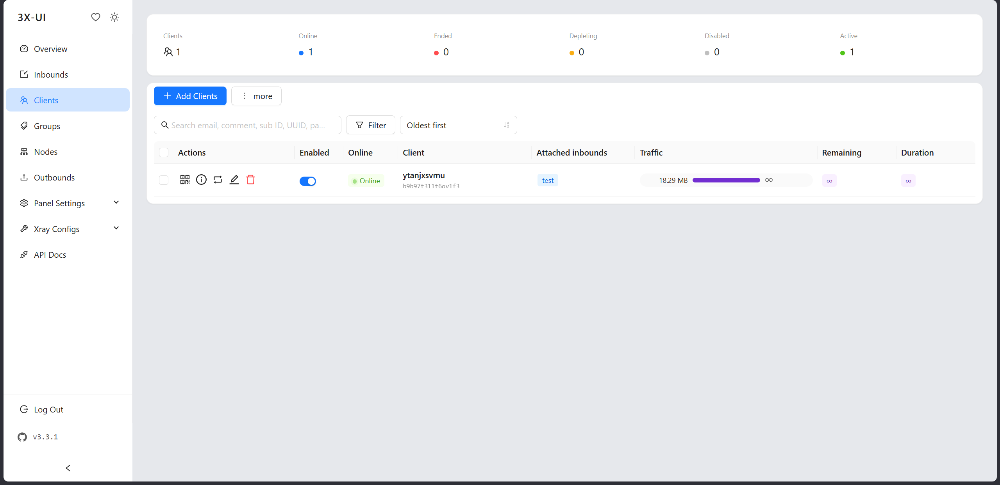
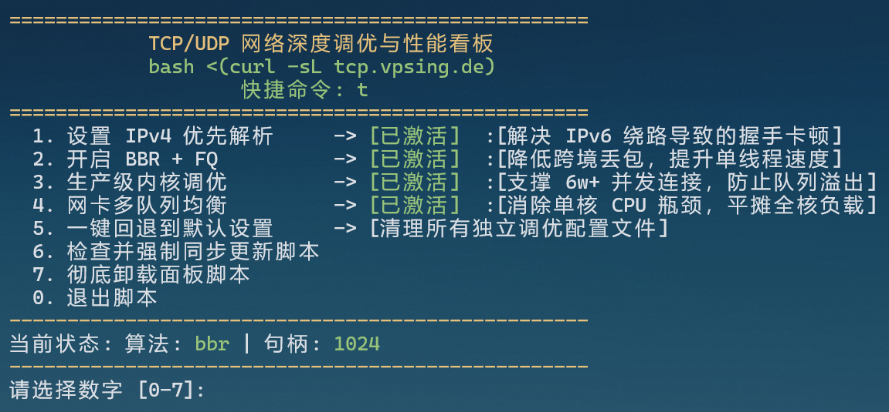

---
{
  title: 初入VPS,
  date: 2026-06-16,
  tags: [ Proxy, VPS ],
  draft: false,
  archive: true,
  slug: essay-260616-2khr
}
---

准备根据6神的推荐，购买便宜的EVOXT他家的VPS，马来西亚-VM-0.75，叠加95%的优惠码，支付宝结算花了33块，属于是当交学费了，系统选的是Debian 13，1C1G10G，跑docker这些估计都不行，太小了，能正常折腾+科学上网我就心满意足了。

开始折腾，通过`ssh root@202.61.74.41 -p 22`连接VPS，密码复制粘贴就行。

安装3x-ui面板：
```bash
bash <(curl -Ls https://raw.githubusercontent.com/mhsanaei/3x-ui/master/install.sh)
```

端口设置：60512


```
═══════════════════════════════════════════
Panel Installation Complete!
═══════════════════════════════════════════
Username:    RrnXKl13BA
Password:    K1eOVo4Fx6
Port:        60512
WebBasePath: o6O14pvsHWGT951wZQ
Database:    SQLite (/etc/x-ui/x-ui.db)
Access URL:  https://202.61.74.41:60512/o6O14pvsHWGT951wZQ
API Token:   MTAl1IPmLa8LyVgWIzQs3k7TvYkhDrpBytlqsgGIdDcTw5tr
═══════════════════════════════════════════
```

我靠，OK了，6神的搭建教程遗漏一个步骤，就是需要添加clients，也就是客户，然后attach inbound，最后创建就行。



打开小火箭扫码就能用，目前还没优化，延迟在150-200ms内，但是刷X非常快，堪比机场节点的80ms。

运行6神的网络优化脚本 `bash <(curl -sL tcp.vpsing.de)` 进行调优。



优化后速度快了不少，只不过校园网是移动的，没做专门优化，手机是电信，测速能到200M水平。目前比较满意，因为独享终于不用总是弹出cloudflare人机验证了，手机上看X也是秒加载，当然价格还是有点小贵，一个月30多，IP倒是非常干净。

