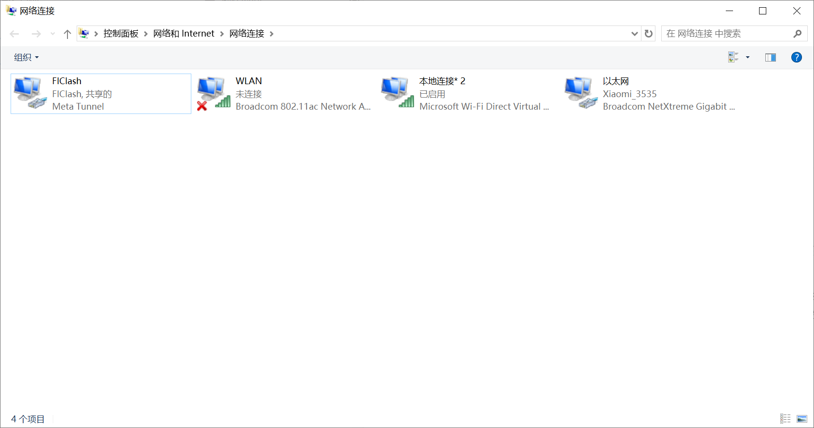
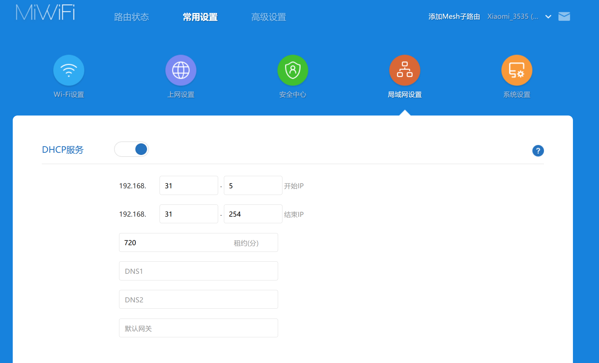

---
{
  title: 局域网代理共享的几种方法,
  description: 让其他设备共享代理上网的几种方法：手机代理共享、Windows 热点共享、Windows 软路由与无 GUI 终端代理，按场景选择,
  date: 2026-08-14,
  tags: [ Network ],
  draft: false,
  archive: true,
  slug: essay-260814-7ywb
}
---
想让局域网里的其他设备（无法安装代理软件的设备、游戏机、服务器等）共享代理上网，思路大致分为两类：**应用层代理共享**（其他设备把流量显式交给一台代理机）和**网关层转发**（把整个局域网的流量通过一台电脑转发出去）。下面按场景整理了四种常见做法。

| 场景 | 推荐方案 |
| --- | --- |
| 偶尔给电脑临时用一下 | 方案一：手机共享代理 |
| 几台设备、要求简单稳定 | 方案二：Windows 热点共享 |
| 整个局域网都要科学上网 | 方案三：Windows 软路由 |
| 无桌面环境的 Linux（服务器 / WSL） | 方案四：无 GUI 终端代理 |

## 方案一：手机共享代理

适用：手机上有现成的代理客户端，电脑偶尔需要临时走代理。

以 Clash Meta for Android 举例，打开 Settings—Override，设置 Mixed Port 为 7890，并将 Allow LAN 设置为 Enabled。接着在 Android 设备的 Wi-Fi 设置里，编辑网络—高级选项，把 IP 设置为静态，自行设置一个好记的 IP，例如 `192.168.31.66`（66 是手动设置的，192.168.31 是路由器网段）。

来到电脑端，这里以 Arch Linux 命令行举例，先用 ping 测试能否连通手机：

```bash
ping -c 5 192.168.31.66
```

临时为当前终端设置环境变量，用于程序代理配置：

```bash
export http_proxy="http://192.168.31.66:7890"
export https_proxy="http://192.168.31.66:7890"
```

有些程序不会遵循系统环境变量，可以使用 proxychains-ng 来强制走代理：

```bash
pacman -S proxychains-ng
```

编辑 `/etc/proxychains.conf`，在末尾的 `[ProxyList]` 下添加：

```bash
http 192.168.31.66 7890
```

在命令前面加上 `proxychains4` 即可强制程序走代理：

```bash
proxychains4 yay -S v2rayn
```

## 方案二：Windows 热点共享

适用：Windows 电脑开热点，把代理共享给连上热点的设备。基于 Windows 的 Internet 连接共享（ICS）实现，最简单也最稳定，缺点是转发对网卡性能要求较高。

这里用基于 Clash 系开发的 FIClash 举例：打开虚拟网卡（Tun），挑选一个延迟较低的节点。

打开电脑的 Wi-Fi 热点，修改名称与密码。

打开控制面板—网络和 Internet—网络连接，找到热点对应的网卡（一般叫"本地连接"，下面写着 Microsoft Wi-Fi Direct Virtual Adapter）。

再找到 FIClash 的虚拟网卡，右键属性，点击上方的共享选项，勾选"允许其他网络用户连接"，并选择共享的网络连接为热点网卡。



## 方案三：Windows 软路由

适用：整个局域网内的设备都走代理，包括不支持手动配置网关的设备。相比方案二，软路由对网卡性能要求更低，覆盖范围更大。

需要两个软件：

- **v2rayN**
- **RouteForwarder**

### 1. 软路由电脑配置

打开网络适配器—更多适配器选项—编辑 TCP/IPv4，手动分配一个可使用的 IP 地址，子网掩码设置为 `255.255.255.0`，网关为默认网关（一般为 `192.168.xxx.1`），首选 DNS 服务器也设置为默认网关，然后保存应用。

打开 RouteForwarder 路由转发，按提示重启电脑，重启后命令行输入 `ipconfig /all`，查看是否成功开启路由转发。

### 2. v2rayN 配置

以管理员身份运行 v2rayN，选几个节点地址添加到 RouteForwarder 额外路由条目，路由动作选择"添加路由"，点击执行；然后再将 v2rayN 的路由设置为全局 Global，并打开 Tun 模式即可。

### 3. 设备网关配置

要使与软路由连接同一 Wi-Fi 的设备科学上网，需要单独进行网关配置：

- **Windows**：同第 1 步，将网关改为软路由电脑的 IP 地址，DNS 服务器设置为公共 DNS，如 `8.8.8.8`。
- **Android**：打开 Wi-Fi 设置，将 IP 设置为静态 Static，网关及 DNS 设置同上。
- **Linux**：同 Windows。



### 4. 路由器 DHCP 配置（可选）

有些设备可能不支持手动配置网关，可以直接在路由器里修改 DHCP 的网关和 DNS。这里以小米 AX3000T 举例：

进入常用设置—局域网设置—DHCP 服务，将默认网关改为 Windows 电脑的 IP，DNS 为 `8.8.8.8` 和 `1.1.1.1`，保存后提示重启路由器网络环境，重启后等待片刻，断开重新连接网络即可科学上网。

> 上述很多设置可以直接在路由器进行修改，前提是要知道路由器管理员密码。

### 5. 停止软路由服务

关闭 Tun 模式，取消勾选路由转发，然后重启电脑即可恢复如初；如果改过路由器 DHCP，记得把手动修改的部分删除，路由器重启后会自动恢复默认设置。

## 方案四：无 GUI 终端代理

适用：没有桌面环境的 Arch Linux（如服务器、WSL），直接在终端里跑代理。

安装 mihomo：

```bash
# 需配置 archlinuxcn 仓库，否则会提示包不存在
pacman -S mihomo
```

使用海豚测速站提供的订阅转换网站，将通用订阅转换为短订阅：

[Sublink Worker - 轻量高效的订阅链接转换工具](https://sub.haitunt.org/)

使用 wget 将转换后的订阅写入本地配置文件（以下为 fish 语法）：

```fish
set SUB_URL "这里输入转换后的短订阅"
wget -O ~/.config/mihomo/config.yaml "$SUB_URL"
```

运行 mihomo 服务，首次启动会提示下载 MMDB，等待片刻后服务正式启动，mihomo 监听 7890 端口。接着配置终端代理：

```fish
set -gx http_proxy http://127.0.0.1:7890
set -gx https_proxy http://127.0.0.1:7890
```

如果要永久生效，编辑终端环境变量，这里用 fish 举例：

```fish
# ~/.config/fish/config.fish
set -gx http_proxy http://127.0.0.1:7890
set -gx https_proxy http://127.0.0.1:7890
set -gx all_proxy socks5://127.0.0.1:7890
```

> 目前只在 WSL 中的 Arch Linux 测试过，并且未成功科学上网，问了一下 AI，发现是 WSL 的网络环境比较特殊，如果是在真机测试，大概率是没问题的。

## 小结

- 只想让**一两台设备**临时走代理：方案一最轻量，改改环境变量即可。
- 想**开热点给设备用**、追求简单稳定：方案二。
- 想**整个局域网无感科学上网**：方案三，配好路由器 DHCP 后所有设备都不用再改。
- 手里是**无桌面的 Linux**：方案四，mihomo + 终端环境变量。
